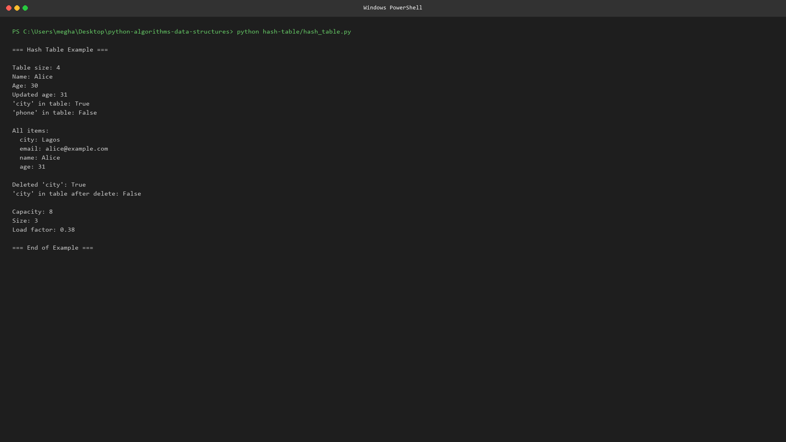
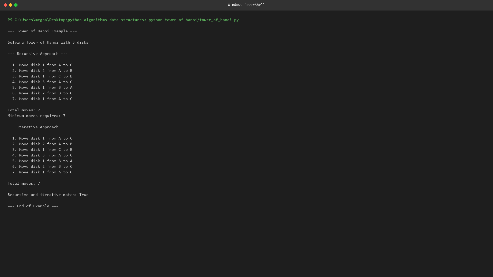
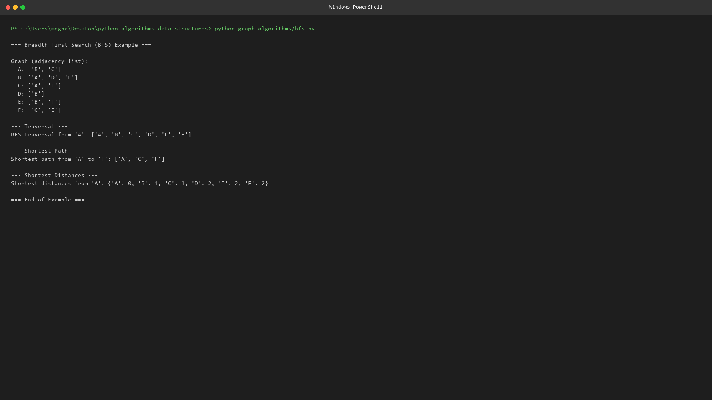
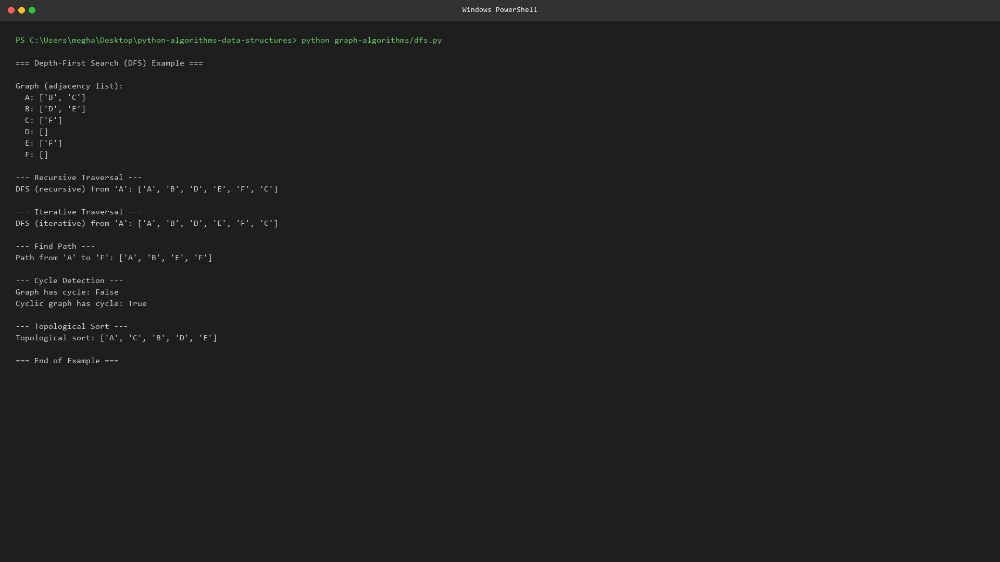
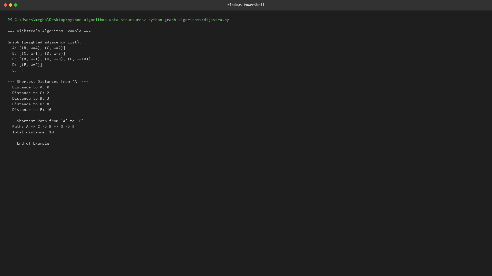
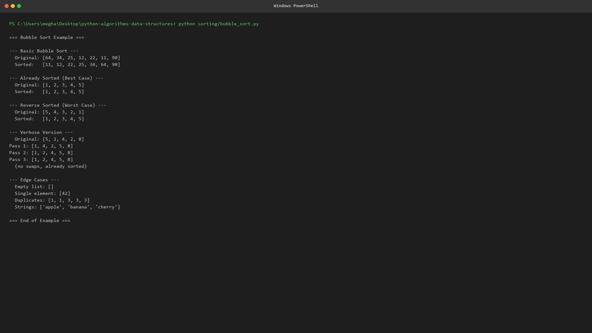
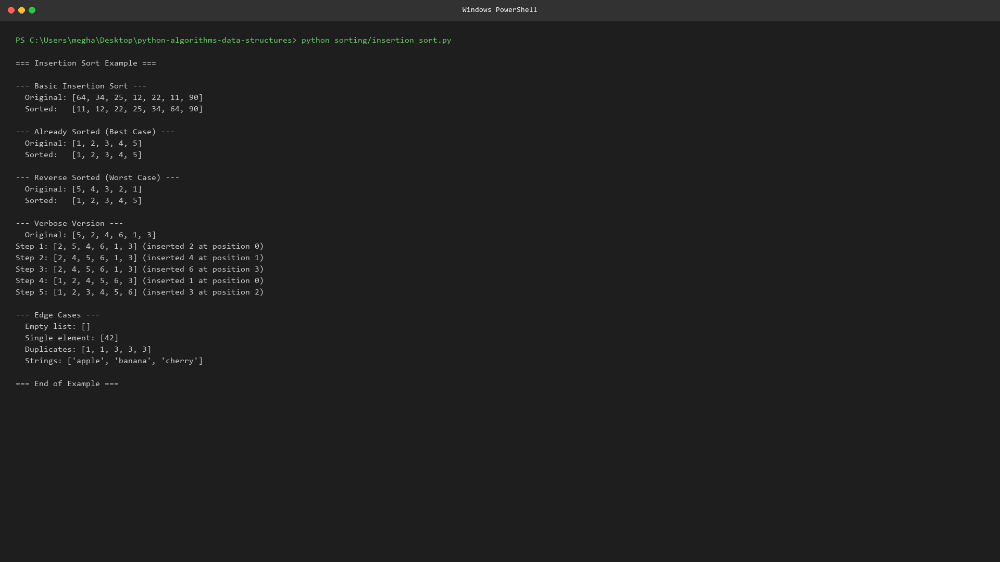

# 🐍 Python Algorithms & Data Structures

<div align="center">


**A production-quality collection of classic algorithms and data structures implemented in Python.**

</div>

---

## 📖 Overview

Welcome to **python-algorithms-data-structures** — a curated, beginner-friendly
repository containing clean, well-documented, and fully functional
implementations of fundamental algorithms and data structures.

Every Python file in this repository:

- ✅ Follows **PEP 8** style guidelines
- ✅ Includes comprehensive **docstrings**
- ✅ Uses **type hints** where appropriate
- ✅ Contains **beginner-friendly comments**
- ✅ **Validates inputs** and raises meaningful errors
- ✅ **Executes independently** — just run `python <file>.py`
- ✅ Includes **usage examples** in every file
- ✅ Documents **time and space complexity**

---

## ✨ Features

| Feature | Description |
|---|---|
| 🎓 **Educational** | Every algorithm is explained with theory, diagrams, and examples |
| 🧪 **Tested** | Each file includes runnable usage examples |
| 📐 **Type-Safe** | Full type hint coverage for better IDE support |
| 🛡️ **Robust** | Input validation and error handling in every function |
| 📚 **Documented** | Comprehensive READMEs, docstrings, and a complexity cheatsheet |
| 🎨 **Visual** | SVG diagrams and icons for visual learners |

---

## 🧠 Algorithms

### Hash Table

A hash table (hash map) implementation using **separate chaining** for
collision resolution, with automatic resizing when the load factor
exceeds a threshold.

- **File:** [`hash-table/hash_table.py`](hash-table/hash_table.py)
- **Time Complexity:** O(1) average for insert/search/delete
- **Space Complexity:** O(n)
- **Screenshot:** 

### Tower of Hanoi

A classic recursive puzzle solver. Move *n* disks from a source rod to a
destination rod following the rules of the Tower of Hanoi.

- **File:** [`tower-of-hanoi/tower_of_hanoi.py`](tower-of-hanoi/tower_of_hanoi.py)
- **Time Complexity:** O(2ⁿ)
- **Space Complexity:** O(n)
- **Screenshot:** 

### Graph Algorithms

| Algorithm | File | Time Complexity | Space Complexity |
|---|---|---|---|
| **BFS** (Breadth-First Search) | [`graph-algorithms/bfs.py`](graph-algorithms/bfs.py) | O(V + E) | O(V) |
| **DFS** (Depth-First Search) | [`graph-algorithms/dfs.py`](graph-algorithms/dfs.py) | O(V + E) | O(V) |
| **Dijkstra's** Shortest Path | [`graph-algorithms/dijkstra.py`](graph-algorithms/dijkstra.py) | O((V + E) log V) | O(V + E) |

**Screenshots:**
- 
- 
- 

### Recursion

| Algorithm | File | Time Complexity | Space Complexity |
|---|---|---|---|
| **Fibonacci** (3 approaches) | [`recursion/fibonacci.py`](recursion/fibonacci.py) | O(n) to O(2ⁿ) | O(1) to O(n) |
| **Parentheses Generator** | [`recursion/parentheses_generator.py`](recursion/parentheses_generator.py) | O(4ⁿ/√n) | O(n) |

**Screenshots:**
- 
- 

### Sorting

| Algorithm | File | Best | Average | Worst | Space |
|---|---|---|---|---|---|
| **Bubble Sort** | [`sorting/bubble_sort.py`](sorting/bubble_sort.py) | O(n) | O(n²) | O(n²) | O(1) |
| **Insertion Sort** | [`sorting/insertion_sort.py`](sorting/insertion_sort.py) | O(n) | O(n²) | O(n²) | O(1) |

**Screenshots:**
- 
- 

---

## 📁 Repository Structure

```
python-algorithms-data-structures/
├── README.md                  # This file
├── LICENSE                    # MIT License
├── assets/                    # Diagrams, icons, and screenshots
│   ├── diagrams/              # SVG diagrams for each algorithm
│   ├── icons/                 # SVG icons
│   └── screenshots/          # Screenshot guidelines
├── docs/                      # Additional documentation
│   ├── project-structure.txt  # Directory explanations
│   └── complexity-cheatsheet.md  # Big-O reference
├── hash-table/                # Hash table implementation
├── tower-of-hanoi/           # Tower of Hanoi solver
├── graph-algorithms/          # BFS, DFS, Dijkstra
├── recursion/                 # Fibonacci, parentheses generator
└── sorting/                   # Bubble sort, insertion sort
```

For a detailed breakdown, see [`docs/project-structure.txt`](docs/project-structure.txt).

---

## 📥 Installation

### Prerequisites

- **Python 3.8** or higher
- No external dependencies required (standard library only)

### Clone the Repository

```bash
git clone https://github.com/tarek200614/python-algorithms-data-structures.git
cd python-algorithms-data-structures
```

### Verify Python

```bash
python --version
# Python 3.8.x or higher
```

---

## 🚀 Usage

Each Python file is **self-contained** and can be run independently:

```bash
# Run the hash table example
python hash-table/hash_table.py

# Run the Tower of Hanoi example
python tower-of-hanoi/tower_of_hanoi.py

# Run graph algorithms
python graph-algorithms/bfs.py
python graph-algorithms/dfs.py
python graph-algorithms/dijkstra.py

# Run recursion examples
python recursion/fibonacci.py
python recursion/parentheses_generator.py

# Run sorting algorithms
python sorting/bubble_sort.py
python sorting/insertion_sort.py
```

### Importing as a Module

You can also import any module into your own code:

```python
import sys
sys.path.insert(0, "hash-table")
from hash_table import HashTable

table = HashTable()
table.insert("name", "Alice")
print(table.get("name"))  # Output: Alice
```

---

## 📊 Complexity Table

| Algorithm | Best | Average | Worst | Space |
|---|---|---|---|---|
| Hash Table (insert/search/delete) | O(1) | O(1) | O(n) | O(n) |
| Tower of Hanoi | O(2ⁿ) | O(2ⁿ) | O(2ⁿ) | O(n) |
| BFS | O(V + E) | O(V + E) | O(V + E) | O(V) |
| DFS | O(V + E) | O(V + E) | O(V + E) | O(V) |
| Dijkstra's | O((V + E) log V) | O((V + E) log V) | O((V + E) log V) | O(V + E) |
| Fibonacci (iterative) | O(n) | O(n) | O(n) | O(1) |
| Fibonacci (memoized) | O(n) | O(n) | O(n) | O(n) |
| Fibonacci (naive) | O(2ⁿ) | O(2ⁿ) | O(2ⁿ) | O(n) |
| Parentheses Generator | O(4ⁿ/√n) | O(4ⁿ/√n) | O(4ⁿ/√n) | O(n) |
| Bubble Sort | O(n) | O(n²) | O(n²) | O(1) |
| Insertion Sort | O(n) | O(n²) | O(n²) | O(1) |

---

## 🛠️ Technologies

- **Language:** Python 3.8+
- **Standard Library:** `collections`, `functools`, `heapq`, `typing`
- **Style:** PEP 8
- **Type Checking:** Full type hint coverage
- **Documentation:** Markdown, SVG diagrams
- **License:** MIT

---

## 🎓 Learning Outcomes

By studying this repository, you will learn to:

1. **Implement** fundamental data structures (hash tables, graphs)
2. **Understand** time and space complexity analysis (Big-O notation)
3. **Apply** recursion to solve problems (Tower of Hanoi, Fibonacci, backtracking)
4. **Traverse** graphs using BFS and DFS
5. **Find** shortest paths using Dijkstra's algorithm
6. **Sort** data using comparison-based algorithms
7. **Write** clean, documented, type-safe Python code
8. **Validate** inputs and handle errors gracefully
9. **Analyze** algorithm trade-offs and choose the right approach

---

## 👤 Author

**python-algorithms-data-structures contributors**

Created as an educational resource for learning algorithms and data
structures in Python.

---

## 📄 License

This project is licensed under the **MIT License** — see the
[LICENSE](LICENSE) file for details.

---

<div align="center">

⭐ **If you found this repository helpful, please give it a star!** ⭐

</div>
