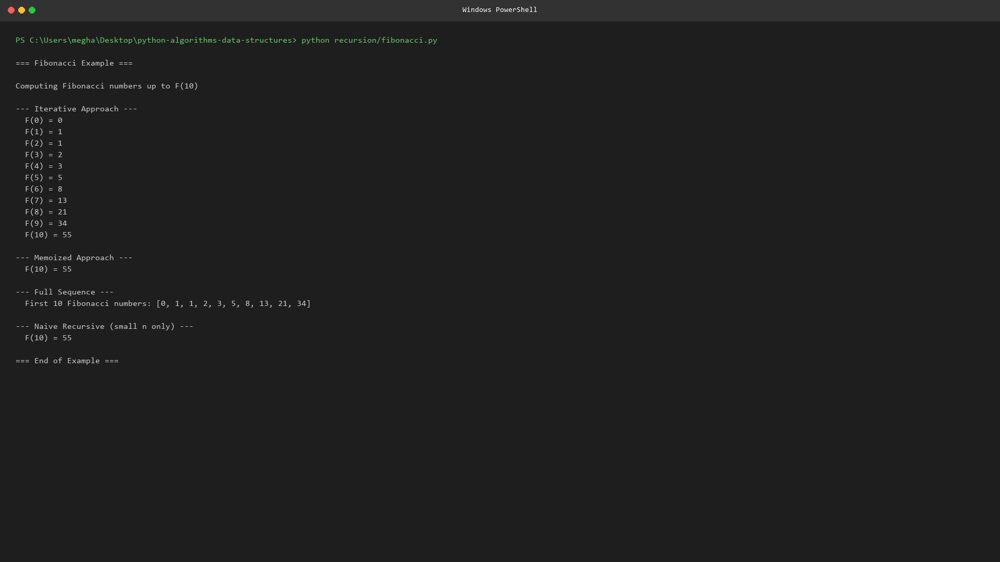
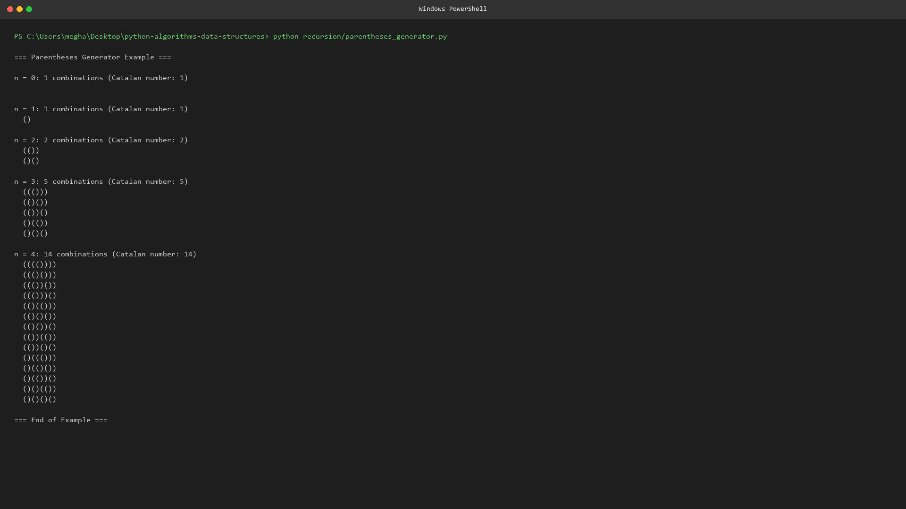

# 🔄 Recursion

<div align="center">


</div>

---

## 📌 Purpose

This folder contains classic **recursive** algorithms that demonstrate
how problems can be solved by breaking them into smaller subproblems.

| Algorithm | File | Purpose |
|---|---|---|
| **Fibonacci** | [`fibonacci.py`](fibonacci.py) | Compute Fibonacci numbers (3 approaches) |
| **Parentheses Generator** | [`parentheses_generator.py`](parentheses_generator.py) | Generate valid parentheses combinations |

---

## 📚 Theory

### Recursion Basics

Recursion is a technique where a function calls itself to solve a smaller
instance of the same problem. Every recursive function needs:

1. **Base case** — the simplest instance that can be solved directly.
2. **Recursive case** — reduces the problem toward the base case.

### Fibonacci

The Fibonacci sequence: F(0)=0, F(1)=1, F(n)=F(n-1)+F(n-2).

Three approaches:
- **Naive recursive:** O(2ⁿ) — recomputes subproblems.
- **Memoized:** O(n) — caches results using `@lru_cache`.
- **Iterative:** O(n) time, O(1) space — most efficient.

### Parentheses Generator (Backtracking)

Given n pairs, generate all valid combinations. Uses **backtracking**:
at each step, add '(' if we haven't used all n, add ')' if more '(' than ')'.
The count of valid combinations is the **Catalan number** C(n).

---

## ⏱️ Time Complexity

| Algorithm | Time Complexity | Space Complexity |
|---|---|---|
| Fibonacci (naive) | O(2ⁿ) | O(n) |
| Fibonacci (memoized) | O(n) | O(n) |
| Fibonacci (iterative) | O(n) | O(1) |
| Parentheses Generator | O(4ⁿ/√n) | O(n) |

---

## 📝 Example

```python
from fibonacci import fibonacci_iterative, fibonacci_sequence
from parentheses_generator import generate_parentheses

print(fibonacci_iterative(10))        # 55
print(fibonacci_sequence(10))        # [0, 1, 1, 2, 3, 5, 8, 13, 21, 34]
print(generate_parentheses(3))       # ['((()))', '(()())', '(())()', '()(())', '()()()']
```

---

## ▶️ How to Run

```bash
cd recursion
python fibonacci.py
python parentheses_generator.py
```

---

## 📊 Diagram

See the recursion tree diagram: [`../assets/diagrams/recursion-tree.svg`](../assets/diagrams/recursion-tree.svg)

## 📸 Screenshots

- 
- 

---

[← Back to Root](../README.md)
